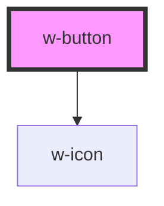

# w-button

<!-- Auto Generated Below -->

## Properties

| Property        | Attribute        | Description                          | Type                                                                                                                                                                                                                                                                                                                                                                                          | Default     |
| --------------- | ---------------- | ------------------------------------ | --------------------------------------------------------------------------------------------------------------------------------------------------------------------------------------------------------------------------------------------------------------------------------------------------------------------------------------------------------------------------------------------- | ----------- |
| `color`         | `color`          | button text size                     | `"gray" \| "white" \| "yellow"`                                                                                                                                                                                                                                                                                                                                                               | `'gray'`    |
| `disabled`      | `disabled`       | button html "disabled" attribute     | `boolean`                                                                                                                                                                                                                                                                                                                                                                                     | `false`     |
| `icon`          | `icon`           | button html "type" attribute         | `"comment" \| "eye" \| "close" \| "close-circle" \| "check-circle" \| "clock" \| "ink-pen" \| "times-circle" \| "arrow-down" \| "question-circle" \| "eye-large" \| "blockchain" \| "accessibility" \| "hamburger" \| "hamburger-close" \| "arrow-right" \| "dots" \| "check-ring" \| "check" \| "api" \| "shopify" \| "wordpress" \| "gear" \| "search" \| "calendar" \| "shield" \| "info"` | `undefined` |
| `outline`       | `outline`        | renders button as underlined text    | `boolean`                                                                                                                                                                                                                                                                                                                                                                                     | `false`     |
| `size`          | `size`           | button text size                     | `"base" \| "lg" \| "sm" \| "xl" \| "xs"`                                                                                                                                                                                                                                                                                                                                                      | `'lg'`      |
| `text`          | `text`           | renders button as underlined text    | `boolean`                                                                                                                                                                                                                                                                                                                                                                                     | `false`     |
| `type`          | `type`           | button html "type" attribute         | `string`                                                                                                                                                                                                                                                                                                                                                                                      | `'button'`  |
| `underlineNone` | `underline-none` | underline decoration for text button | `boolean`                                                                                                                                                                                                                                                                                                                                                                                     | `false`     |

## Dependencies

### Depends on

- [w-icon](../w-icon)

### Graph

----------------------------------------------

*Built with [StencilJS](https://stenciljs.com/)*
