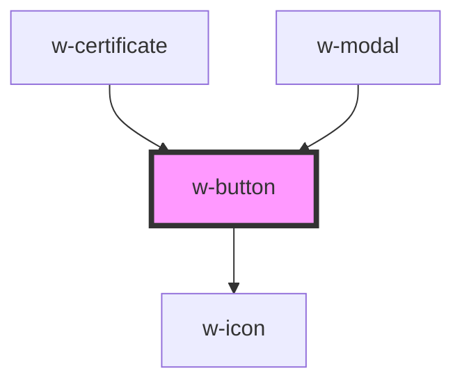

# w-button

<!-- Auto Generated Below -->

## Properties

| Property   | Attribute  | Description                       | Type                                     | Default     |
| ---------- | ---------- | --------------------------------- | ---------------------------------------- | ----------- |
| `disabled` | `disabled` | button html "disabled" attribute  | `boolean`                                | `false`     |
| `icon`     | `icon`     | button html "type" attribute      | `string`                                 | `undefined` |
| `outline`  | `outline`  | renders button as underlined text | `boolean`                                | `false`     |
| `size`     | `size`     | button text size                  | `"base" \| "lg" \| "sm" \| "xl" \| "xs"` | `'lg'`      |
| `text`     | `text`     | renders button as underlined text | `boolean`                                | `false`     |
| `type`     | `type`     | button html "type" attribute      | `string`                                 | `'button'`  |

## Dependencies

### Used by

 - [w-certificate](../w-certificate)
 - [w-modal](../w-modal)

### Depends on

- [w-icon](../w-icon)

### Graph

----------------------------------------------

*Built with [StencilJS](https://stenciljs.com/)*
