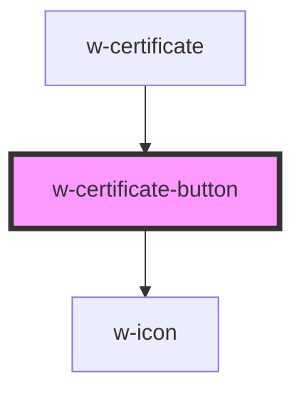

# w-certificate-button

<!-- Auto Generated Below -->

## Properties

| Property           | Attribute           | Description                                                                                              | Type                                           | Default     |
| ------------------ | ------------------- | -------------------------------------------------------------------------------------------------------- | ---------------------------------------------- | ----------- |
| `color`            | `color`             | Specify the color of the icon and tet.                                                                   | `string`                                       | `undefined` |
| `icon`             | `icon`              | Change the icon of the button.                                                                           | `"none" \| "shield" \| "wordproof"`            | `undefined` |
| `shape`            | `shape`             | Specify the shape of the button ('box' \| 'text' \| 'pill')                                              | `"" \| "box" \| "classic" \| "pill" \| "text"` | `'text'`    |
| `sharedIdentifier` | `shared-identifier` | Specify shared identifier to allow pages with multiple certificates.                                     | `string`                                       | `''`        |
| `text`             | `text`              | Specify the text on the button, if not specified defaults to 'View this content's Timestamp certificate' | `string`                                       | `undefined` |
| `variant`          | `variant`           | Specify the variant used.                                                                                | `string`                                       | `undefined` |

## Dependencies

### Used by

 - [w-certificate](../w-certificate)

### Depends on

- [w-icon](../w-icon)

### Graph

----------------------------------------------

*Built with [StencilJS](https://stenciljs.com/)*
