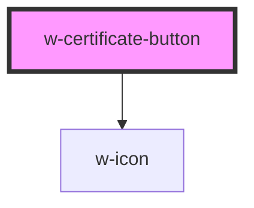

# w-certificate-button

<!-- Auto Generated Below -->

## Properties

| Property  | Attribute | Description                                                                                  | Type                        | Default     |
| --------- | --------- | -------------------------------------------------------------------------------------------- | --------------------------- | ----------- |
| `shape`   | `shape`   | shape of the button ('box' \| 'text' \| 'pill')                                              | `"box" \| "pill" \| "text"` | `'box'`     |
| `text`    | `text`    | text on the button, if not specified defaults to 'View this content's Timestamp certificate' | `string`                    | `undefined` |
| `variant` | `variant` | variant of the button with certain shape                                                     | `string`                    | `undefined` |

## Dependencies

### Depends on

- [w-icon](../w-icon)

### Graph

----------------------------------------------

*Built with [StencilJS](https://stenciljs.com/)*
