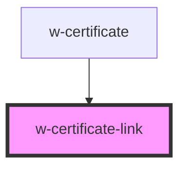

# w-certificate-link

<!-- Auto Generated Below -->

## Properties

| Property   | Attribute   | Description                  | Type      | Default |
| ---------- | ----------- | ---------------------------- | --------- | ------- |
| `linkText` | `link-text` | custom certificate link text | `string`  | `''`    |
| `noIcon`   | `no-icon`   | hides icon                   | `boolean` | `false` |

## Dependencies

### Used by

 - [w-certificate](../w-certificate)

### Graph

----------------------------------------------

*Built with [StencilJS](https://stenciljs.com/)*
