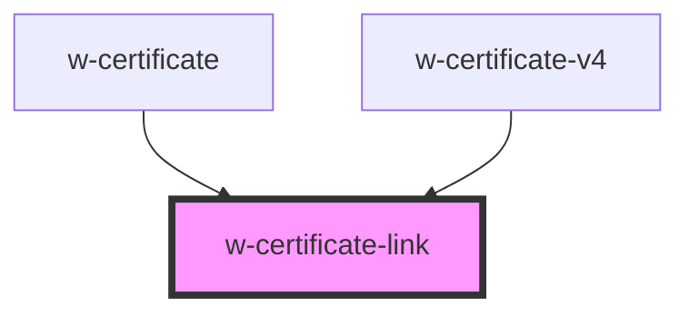

# w-certificate-link

<!-- Auto Generated Below -->

## Properties

| Property | Attribute | Description | Type      | Default |
| -------- | --------- | ----------- | --------- | ------- |
| `noIcon` | `no-icon` | hides icon  | `boolean` | `false` |

## Dependencies

### Used by

 - [w-certificate](../w-certificate)
 - [w-certificate-v4](../w-certificate-v4)

### Graph

----------------------------------------------

*Built with [StencilJS](https://stenciljs.com/)*
