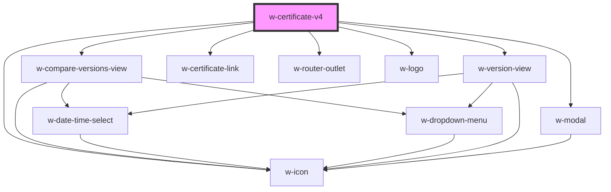

# w-certificate-v4

<!-- Auto Generated Below -->

## Properties

| Property   | Attribute   | Description                    | Type      | Default     |
| ---------- | ----------- | ------------------------------ | --------- | ----------- |
| `linkText` | `link-text` | custom certificate link text   | `string`  | `undefined` |
| `noIcon`   | `no-icon`   | hides icon on certificate link | `boolean` | `false`     |

## Dependencies

### Depends on

- [w-compare-versions-view](./views/w-compare-versions-view)
- [w-version-view](./views/w-version-view)
- [w-certificate-link](../w-certificate-link)
- [w-modal](../w-modal)
- [w-icon](../w-icon)
- [w-router-outlet](../w-router-outlet)
- [w-logo](../w-logo)

### Graph

----------------------------------------------

*Built with [StencilJS](https://stenciljs.com/)*
