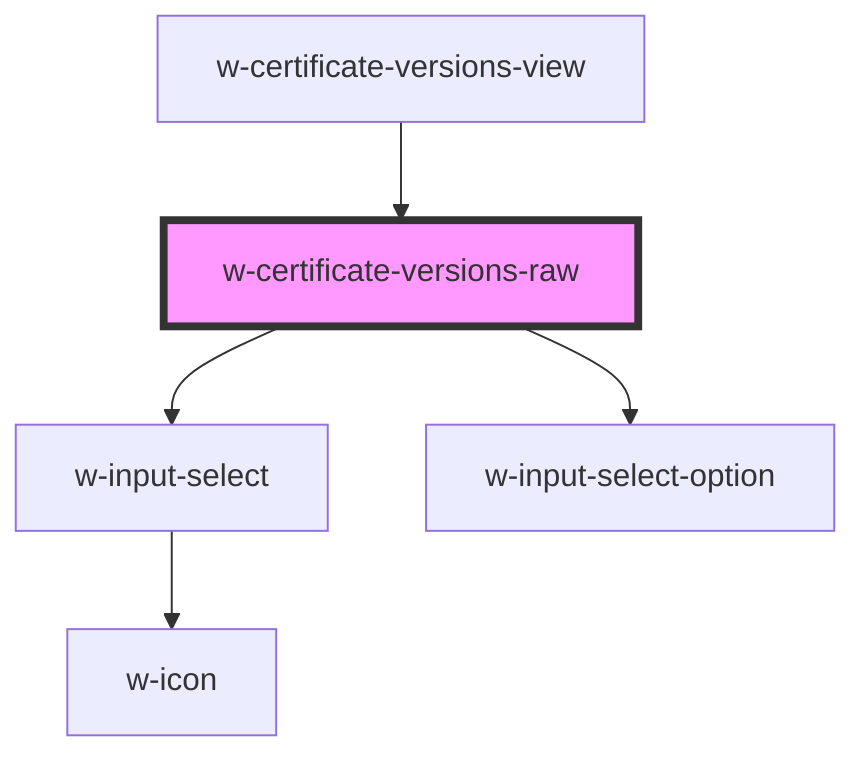

# w-certificate-versions-raw

<!-- Auto Generated Below -->

## Properties

| Property       | Attribute | Description | Type               | Default     |
| -------------- | --------- | ----------- | ------------------ | ----------- |
| `allOptions`   | --        |             | `RevisionOption[]` | `undefined` |
| `allRevisions` | --        |             | `WPRevision[]`     | `undefined` |

## Events

| Event    | Description | Type                      |
| -------- | ----------- | ------------------------- |
| `choose` |             | `CustomEvent<WPRevision>` |

## Dependencies

### Used by

 - [w-certificate-versions-view](..)

### Depends on

- [w-input-select](../../../../w-input-select)
- [w-input-select-option](../../../../w-input-select-option)

### Graph

----------------------------------------------

*Built with [StencilJS](https://stenciljs.com/)*
