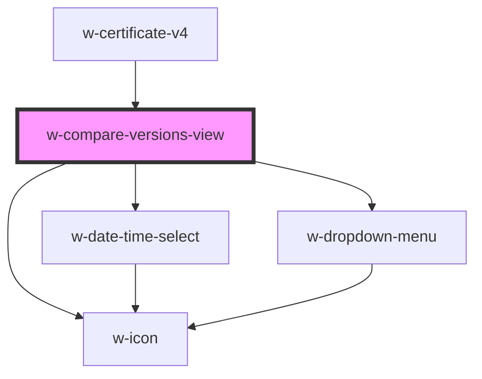

# w-certificate-versions-view

<!-- Auto Generated Below -->

## Properties

| Property  | Attribute | Description | Type                                                                                                                                                                                                                                                                                                                                                                                                                                                  | Default     |
| --------- | --------- | ----------- | ----------------------------------------------------------------------------------------------------------------------------------------------------------------------------------------------------------------------------------------------------------------------------------------------------------------------------------------------------------------------------------------------------------------------------------------------------- | ----------- |
| `content` | --        |             | `WPContent`                                                                                                                                                                                                                                                                                                                                                                                                                                           | `undefined` |
| `locale`  | `locale`  |             | `string`                                                                                                                                                                                                                                                                                                                                                                                                                                              | `undefined` |
| `strings` | --        |             | `{ publishedBy: string; compareVersions: string; thatIsImportantText: string; aboutWordproof: string; todaysRevision: string; selectDayToCompare: string; contentCertificate: string; thisContent: string; hasNotChanged: string; hasChanged: string; lastEdited: string; explainThis: string; timestampChecker: string; viewOnTheBlockchain: string; changed: string; removed: string; viewCode: string; viewContent: string; mostRecent: string; }` | `undefined` |

## Dependencies

### Used by

 - [w-certificate-v4](../..)

### Depends on

- [w-date-time-select](../../../w-date-time-select)
- [w-icon](../../../w-icon)
- [w-dropdown-menu](../../../w-dropdown-menu)

### Graph

----------------------------------------------

*Built with [StencilJS](https://stenciljs.com/)*
