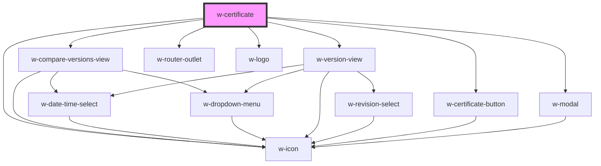

# w-certificate

<!-- Auto Generated Below -->

## Properties

| Property              | Attribute               | Description                                                                                                                                                        | Type                | Default     |
| --------------------- | ----------------------- | ------------------------------------------------------------------------------------------------------------------------------------------------------------------ | ------------------- | ----------- |
| `debug`               | `debug`                 | Enables debug information logging to the console.                                                                                                                  | `boolean`           | `false`     |
| `lastModified`        | `last-modified`         | The datetime the post was last modified. Used to show the visitor if the post is edited after the last timestamp. This is a visual notice, not a security feature. | `string`            | `undefined` |
| `linkText`            | `link-text`             | Change the certificate link text.                                                                                                                                  | `string`            | `undefined` |
| `noIcon`              | `no-icon`               | Hides the icon on certificate link.                                                                                                                                | `boolean`           | `false`     |
| `renderWithoutButton` | `render-without-button` | Render without button inside, if a button is used outside this element.                                                                                            | `boolean`           | `false`     |
| `sharedIdentifier`    | `shared-identifier`     | Specify shared identifier to allow pages with multiple certificates.                                                                                               | `string`            | `''`        |
| `showRevisions`       | `show-revisions`        | Determines if revisions are shown in the certificate.                                                                                                              | `boolean \| string` | `undefined` |

## Dependencies

### Depends on

- [w-compare-versions-view](./views/w-compare-versions-view)
- [w-version-view](./views/w-version-view)
- [w-certificate-button](../w-certificate-button)
- [w-modal](../w-modal)
- [w-icon](../w-icon)
- [w-router-outlet](../w-router-outlet)
- [w-logo](../w-logo)

### Graph

----------------------------------------------

*Built with [StencilJS](https://stenciljs.com/)*
