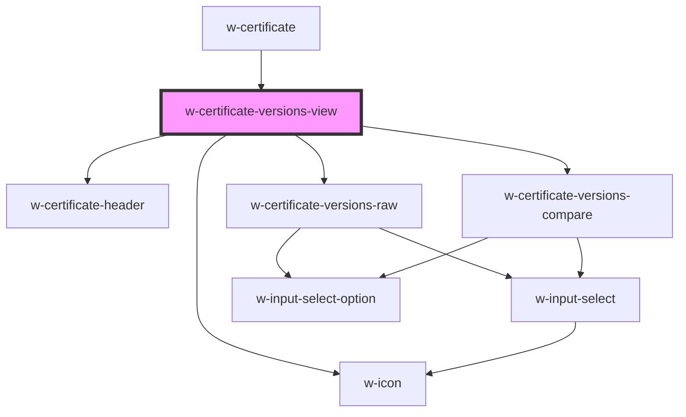

# w-certificate-versions-view

<!-- Auto Generated Below -->

## Properties

| Property       | Attribute       | Description | Type                                                                                                                                                                                                                                                                                                                                                                                                                                                                                                                                                                                                                                                                                                                                                                                                                                                                             | Default     |
| -------------- | --------------- | ----------- | -------------------------------------------------------------------------------------------------------------------------------------------------------------------------------------------------------------------------------------------------------------------------------------------------------------------------------------------------------------------------------------------------------------------------------------------------------------------------------------------------------------------------------------------------------------------------------------------------------------------------------------------------------------------------------------------------------------------------------------------------------------------------------------------------------------------------------------------------------------------------------- | ----------- |
| `content`      | --              |             | `WPContent`                                                                                                                                                                                                                                                                                                                                                                                                                                                                                                                                                                                                                                                                                                                                                                                                                                                                      | `undefined` |
| `hasRevisions` | `has-revisions` |             | `boolean`                                                                                                                                                                                                                                                                                                                                                                                                                                                                                                                                                                                                                                                                                                                                                                                                                                                                        | `undefined` |
| `locale`       | `locale`        |             | `string`                                                                                                                                                                                                                                                                                                                                                                                                                                                                                                                                                                                                                                                                                                                                                                                                                                                                         | `undefined` |
| `raw`          | `raw`           |             | `boolean`                                                                                                                                                                                                                                                                                                                                                                                                                                                                                                                                                                                                                                                                                                                                                                                                                                                                        | `undefined` |
| `strings`      | --              |             | `{ contentIsWordProof: string; contentIsNotWordProof: string; contentHasNotChangedTitle: string; contentHasNotChangedText: string; whyIsThisImportnat: string; lastEdit: string; discoverHowTitle: string; discoverHowText: string; viewPreviousVersions: string; publishedBy: string; importanceTitle: string; importanceParagraph1: string; importanceParagraph2: string; importanceParagraph3: string; importanceParagraph4: string; checkYourself: string; ariaModalTitle: string; ariaModalDescription: string; recent: string; firstTimestamp: string; explanation: string; timestampCheck: string; compare: string; viewOnBlockchain: string; rawInput: string; previous: string; browsePreviousVersions: string; verifyFingerprintTitle: string; verifyFingerprintText: string; viewTimestamp: string; contentHasChangedTitle: string; contentHasChangedText: string; }` | `undefined` |

## Dependencies

### Used by

 - [w-certificate](../..)

### Depends on

- [w-certificate-header](../../components)
- [w-certificate-versions-raw](components)
- [w-certificate-versions-compare](components)
- [w-icon](../../../w-icon)

### Graph

----------------------------------------------

*Built with [StencilJS](https://stenciljs.com/)*
