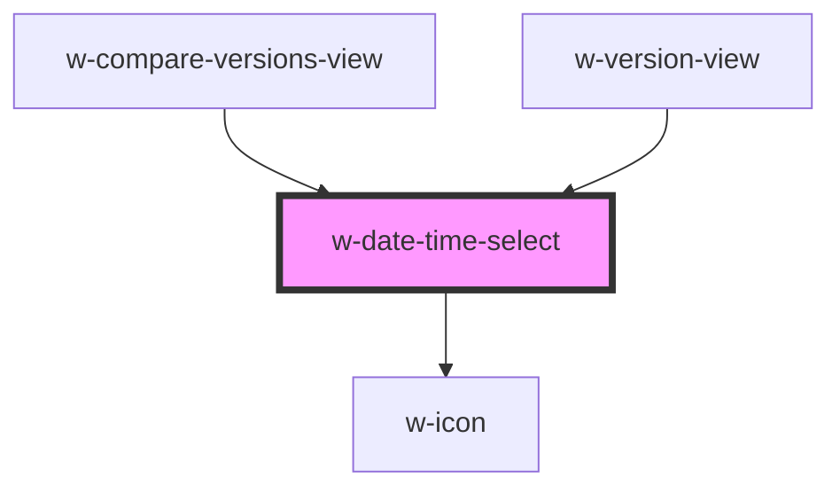

# w-badge

<!-- Auto Generated Below -->

## Properties

| Property        | Attribute     | Description                                                                                             | Type                                                     | Default                                                                                                                                                                                                                                                                                                                                                                                                                                                                                                                                                                                                                                                     |
| --------------- | ------------- | ------------------------------------------------------------------------------------------------------- | -------------------------------------------------------- | ----------------------------------------------------------------------------------------------------------------------------------------------------------------------------------------------------------------------------------------------------------------------------------------------------------------------------------------------------------------------------------------------------------------------------------------------------------------------------------------------------------------------------------------------------------------------------------------------------------------------------------------------------------- |
| `getButtonText` | --            | optional: returns a string displayed on the button openong the dropdown                                 | `(options: DateTimeOption[], selected: number) => VNode` | `(     options: DateTimeOption[],     selected: number \| null,   ): VNode => {     if (selected === null) {       return {this.strings.selectDayToCompare};     }      if (selected === 0) {       return {this.strings.todaysVersion};     }      const foundOption = options.find(option => option.index === selected);      if (foundOption === undefined) {       return {this.strings.selectDayToCompare};     }      if (isSameDay(foundOption.value, new Date())) {       return {this.strings.todaysVersion};     }      return {format(foundOption.value, 'MMMM d, yyyy')};   }` |
| `openToTop`     | `open-to-top` | by default the date picker opens to the bottom of the trigger elemnt if set to true opens it to the top | `boolean`                                                | `false`                                                                                                                                                                                                                                                                                                                                                                                                                                                                                                                                                                                                                                                     |
| `options`       | --            | on array of Date objects to select from                                                                 | `DateTimeOption[]`                                       | `[]`                                                                                                                                                                                                                                                                                                                                                                                                                                                                                                                                                                                                                                                        |
| `selected`      | `selected`    | index of the selected DateTimeOption                                                                    | `number`                                                 | `null`                                                                                                                                                                                                                                                                                                                                                                                                                                                                                                                                                                                                                                                      |

## Dependencies

### Used by

 - [w-compare-versions-view](../w-certificate/views/w-compare-versions-view)
 - [w-version-view](../w-certificate/views/w-version-view)

### Depends on

- [w-icon](../w-icon)

### Graph

----------------------------------------------

*Built with [StencilJS](https://stenciljs.com/)*
