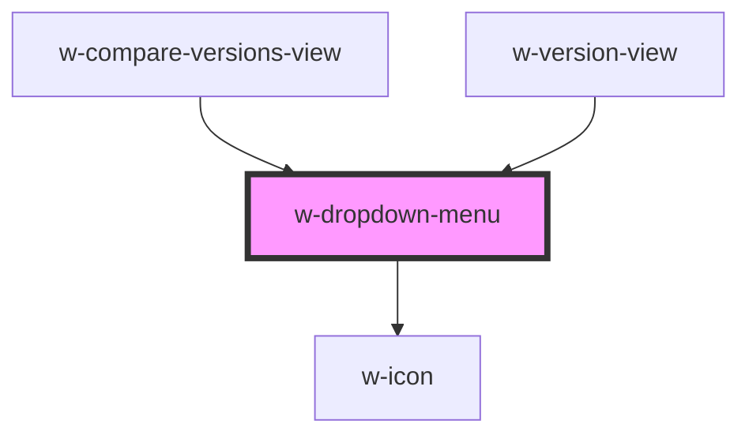

# w-dropdown-menu

<!-- Auto Generated Below -->

## Properties

| Property  | Attribute | Description                 | Type                   | Default     |
| --------- | --------- | --------------------------- | ---------------------- | ----------- |
| `options` | --        | Array of menu items options | `DropdownMenuOption[]` | `undefined` |

## Dependencies

### Used by

 - [w-compare-versions-view](../w-certificate/views/w-compare-versions-view)
 - [w-version-view](../w-certificate/views/w-version-view)

### Depends on

- [w-icon](../w-icon)

### Graph

----------------------------------------------

*Built with [StencilJS](https://stenciljs.com/)*
