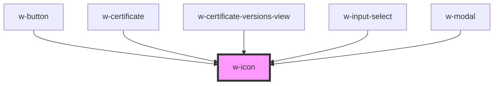

# w-icon

<!-- Auto Generated Below -->

## Properties

| Property | Attribute | Description                                                           | Type                                                                                                                                                                              | Default     |
| -------- | --------- | --------------------------------------------------------------------- | --------------------------------------------------------------------------------------------------------------------------------------------------------------------------------- | ----------- |
| `fit`    | `fit`     | icon will try to fit into the available space maintainig aspect ratio | `boolean`                                                                                                                                                                         | `false`     |
| `name`   | `name`    | renders the icon with corresponding name                              | `"arrow-down" \| "blockchain" \| "check-circle" \| "clock" \| "close" \| "close-circle" \| "comment" \| "eye" \| "eye-large" \| "ink-pen" \| "question-circle" \| "times-circle"` | `undefined` |

## Dependencies

### Used by

 - [w-button](../w-button)
 - [w-certificate](../w-certificate)
 - [w-certificate-versions-view](../w-certificate/views/w-certificate-compare-view)
 - [w-input-select](../w-input-select)
 - [w-modal](../w-modal)

### Graph

----------------------------------------------

*Built with [StencilJS](https://stenciljs.com/)*
