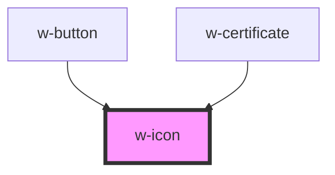

# w-icon

<!-- Auto Generated Below -->

## Properties

| Property | Attribute | Description                                                           | Type      | Default |
| -------- | --------- | --------------------------------------------------------------------- | --------- | ------- |
| `fit`    | `fit`     | icon will try to fit into the available space maintainig aspect ratio | `boolean` | `false` |
| `name`   | `name`    | renders the icon with corresponding name                              | `string`  | `''`    |

## Dependencies

### Used by

 - [w-button](../w-button)
 - [w-certificate](../w-certificate)

### Graph

----------------------------------------------

*Built with [StencilJS](https://stenciljs.com/)*
