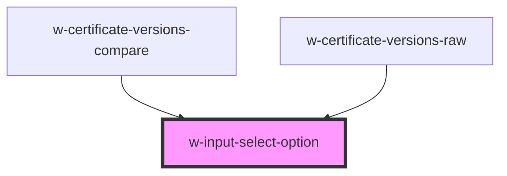

# w-input-select-option

<!-- Auto Generated Below -->

## Properties

| Property   | Attribute  | Description                | Type               | Default |
| ---------- | ---------- | -------------------------- | ------------------ | ------- |
| `disabled` | `disabled` | disabled                   | `boolean`          | `false` |
| `label`    | `label`    | form element error message | `string`           | `''`    |
| `value`    | `value`    | form element error message | `number \| string` | `''`    |

## Events

| Event    | Description | Type                       |
| -------- | ----------- | -------------------------- |
| `choose` |             | `CustomEvent<HTMLElement>` |

## Shadow Parts

| Part       | Description |
| ---------- | ----------- |
| `"option"` |             |

## Dependencies

### Used by

 - [w-certificate-versions-compare](../w-certificate/views/w-certificate-compare-view/components)
 - [w-certificate-versions-raw](../w-certificate/views/w-certificate-compare-view/components)

### Graph

----------------------------------------------

*Built with [StencilJS](https://stenciljs.com/)*
