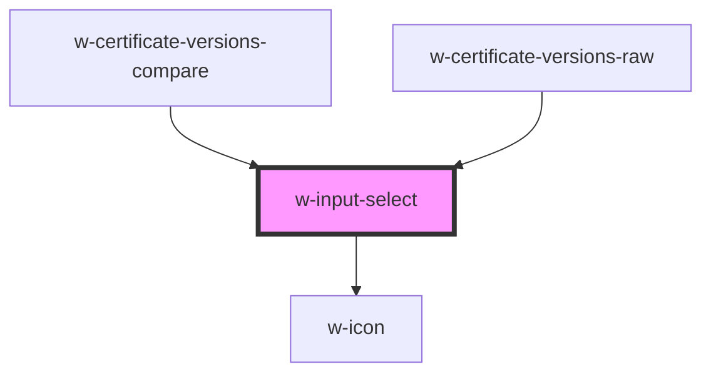

# w-input-select

<!-- Auto Generated Below -->

## Properties

| Property      | Attribute     | Description                | Type               | Default |
| ------------- | ------------- | -------------------------- | ------------------ | ------- |
| `error`       | `error`       | form element error message | `string`           | `''`    |
| `placeholder` | `placeholder` | placeholder                | `string`           | `''`    |
| `value`       | `value`       | value                      | `number \| string` | `''`    |

## Dependencies

### Used by

 - [w-certificate-versions-compare](../w-certificate/views/w-certificate-compare-view/components)
 - [w-certificate-versions-raw](../w-certificate/views/w-certificate-compare-view/components)

### Depends on

- [w-icon](../w-icon)

### Graph

----------------------------------------------

*Built with [StencilJS](https://stenciljs.com/)*
