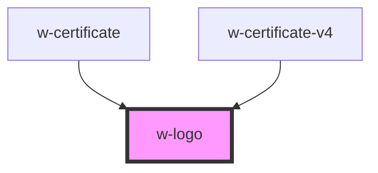

# w-logo

<!-- Auto Generated Below -->

## Properties

| Property        | Attribute        | Description                                                           | Type      | Default |
| --------------- | ---------------- | --------------------------------------------------------------------- | --------- | ------- |
| `blueOnWhite`   | `blue-on-white`  | sets the logo colors to blue on white                                 | `boolean` | `false` |
| `doubleColored` | `double-colored` | shows "WordProof" in blue and teal                                    | `boolean` | `false` |
| `fit`           | `fit`            | icon will try to fit into the available space maintainig aspect ratio | `boolean` | `false` |
| `tealOnWhite`   | `teal-on-white`  | sets the logo colors to blue on white                                 | `boolean` | `false` |
| `text`          | `text`           | adds "WordProof" text to logo                                         | `boolean` | `false` |
| `textLarge`     | `text-large`     | render large logo text                                                | `boolean` | `false` |
| `whiteOnBlue`   | `white-on-blue`  | sets the logo colors to blue on white                                 | `boolean` | `false` |

## Dependencies

### Used by

 - [w-certificate](../w-certificate)
 - [w-certificate-v4](../w-certificate-v4)

### Graph

----------------------------------------------

*Built with [StencilJS](https://stenciljs.com/)*
