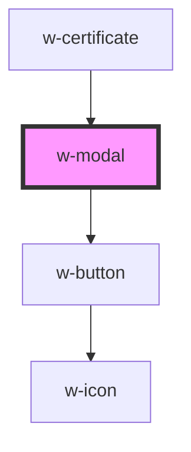

# w-modal

<!-- Auto Generated Below -->

## Properties

| Property               | Attribute                | Description                                               | Type                | Default               |
| ---------------------- | ------------------------ | --------------------------------------------------------- | ------------------- | --------------------- |
| `ariaModalDescription` | `aria-modal-description` | class names added to content wrapper element of the modal | `string`            | `'Modal description'` |
| `ariaModalTitle`       | `aria-modal-title`       | class names added to content wrapper element of the modal | `string`            | `'Modal'`             |
| `backdropClassName`    | `backdrop-class-name`    | class names added to backdrop element of the modal        | `string`            | `''`                  |
| `contentClassName`     | `content-class-name`     | class names added to content wrapper element of the modal | `string`            | `''`                  |
| `modalClassName`       | `modal-class-name`       | class names added to modal element of the modal           | `string`            | `''`                  |
| `rounded`              | `rounded`                | controls visibility of the modal                          | `boolean \| string` | `false`               |
| `visible`              | `visible`                | controls visibility of the modal                          | `boolean`           | `false`               |
| `wrapClassName`        | `wrap-class-name`        | class names added to wrapper element of the modal         | `string`            | `''`                  |

## Events

| Event   | Description | Type               |
| ------- | ----------- | ------------------ |
| `close` |             | `CustomEvent<any>` |

## Dependencies

### Used by

 - [w-certificate](../w-certificate)

### Depends on

- [w-button](../w-button)

### Graph

----------------------------------------------

*Built with [StencilJS](https://stenciljs.com/)*
