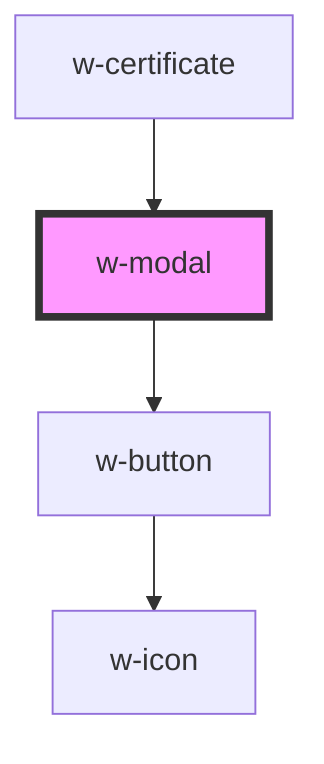

# w-modal

<!-- Auto Generated Below -->

## Properties

| Property  | Attribute | Description                      | Type                | Default |
| --------- | --------- | -------------------------------- | ------------------- | ------- |
| `rounded` | `rounded` | controls visibility of the modal | `boolean \| string` | `false` |
| `visible` | `visible` | controls visibility of the modal | `boolean`           | `false` |

## Events

| Event   | Description | Type               |
| ------- | ----------- | ------------------ |
| `close` |             | `CustomEvent<any>` |

## Dependencies

### Used by

 - [w-certificate](../w-certificate)

### Depends on

- [w-button](../w-button)

### Graph

----------------------------------------------

*Built with [StencilJS](https://stenciljs.com/)*
