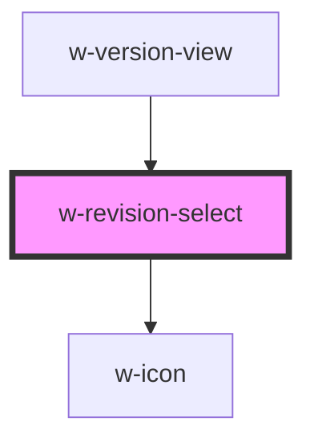

# w-revision-select

<!-- Auto Generated Below -->

## Properties

| Property   | Attribute  | Description                | Type               | Default     |
| ---------- | ---------- | -------------------------- | ------------------ | ----------- |
| `options`  | --         | revision date time options | `DateTimeOption[]` | `undefined` |
| `selected` | `selected` | selected option index      | `number`           | `undefined` |

## Dependencies

### Used by

 - [w-version-view](../w-certificate/views/w-version-view)

### Depends on

- [w-icon](../w-icon)

### Graph

----------------------------------------------

*Built with [StencilJS](https://stenciljs.com/)*
