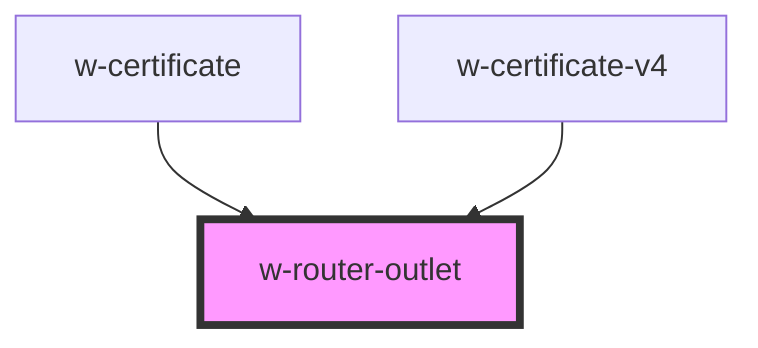

# w-router-outlet

<!-- Auto Generated Below -->

## Properties

| Property | Attribute | Description | Type      | Default     |
| -------- | --------- | ----------- | --------- | ----------- |
| `routes` | --        |             | `Route[]` | `undefined` |

## Dependencies

### Used by

 - [w-certificate](../w-certificate)
 - [w-certificate-v4](../w-certificate-v4)

### Graph

----------------------------------------------

*Built with [StencilJS](https://stenciljs.com/)*
