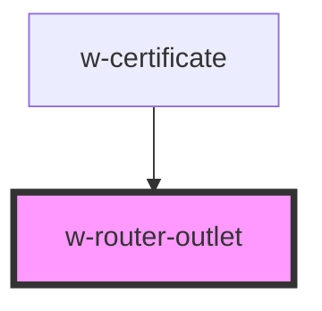

# w-router-outlet

<!-- Auto Generated Below -->

## Properties

| Property        | Attribute        | Description | Type      | Default     |
| --------------- | ---------------- | ----------- | --------- | ----------- |
| `routes`        | --               |             | `Route[]` | `undefined` |
| `showRevisions` | `show-revisions` |             | `boolean` | `undefined` |

## Dependencies

### Used by

 - [w-certificate](../w-certificate)

### Graph

----------------------------------------------

*Built with [StencilJS](https://stenciljs.com/)*
