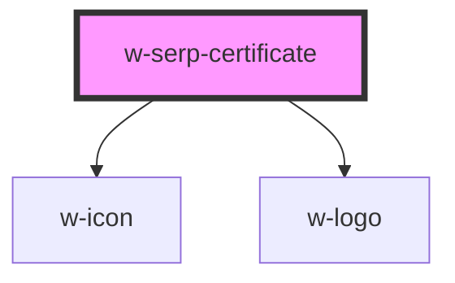

# w-serp-certificate

<!-- Auto Generated Below -->

## Properties

| Property           | Attribute           | Description                                                 | Type     | Default |
| ------------------ | ------------------- | ----------------------------------------------------------- | -------- | ------- |
| `firstTimestamped` | `first-timestamped` | date string when content was first timestamped              | `string` | `''`    |
| `lastEdited`       | `last-edited`       | date string when content was last edited                    | `string` | `''`    |
| `publishedBy`      | `published-by`      | name of an individual or company that published the content | `string` | `''`    |

## Dependencies

### Depends on

- [w-icon](../w-icon)
- [w-logo](../w-logo)

### Graph

----------------------------------------------

*Built with [StencilJS](https://stenciljs.com/)*
